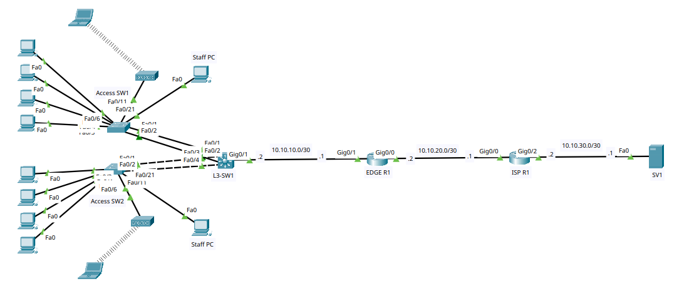

# Gaming Center: Complete Network Design

A Cisco Packet Tracer lab simulating the enterprise network for a gaming center — a routed, multi-VLAN campus network with redundant access uplinks, DHCP, ACL-based segmentation, and a NAT'd internet edge.

## Topology



## What This Lab Demonstrates

- **Internet edge**: `ISP-R1` ↔ `EDGE-R1` on a /30 WAN transit, with `EDGE-R1` performing PAT/NAT overload for all `192.168.0.0/16` internal traffic out its WAN interface.
- **Hosting**: `SV1` sits behind `ISP-R1` on its own /30, representing an Internet-side (DMZ-style) server reachable independent of NAT.
- **Routed core**: `L3-SW1` (Cisco 3560-24PS) is the inter-VLAN routing point for five VLANs — Gaming, Staff, Guest Wi-Fi, Services, and Management — with a default route out to `EDGE-R1`.
- **Redundant access uplinks**: both access switches (`Access-SW1`, `Access-SW2`, Cisco 2960-24TT) connect to the core over 2-port LACP EtherChannel trunks (`Port-channel1` / `Port-channel2`) carrying all VLANs.
- **Security ACLs on the core**:
  - `SECURE_VLAN99` — blocks any VLAN-to-VLAN traffic from reaching the 192.168.99.0/24 management network, applied inbound on the Gaming and Staff SVIs.
  - `GUEST_INBOUND_ACL` — isolates Guest Wi-Fi (VLAN 30) from the Gaming, Staff, Services, and Management subnets, applied inbound on the Guest Wi-Fi SVI.
- **Guest wireless**: two independent guest Wi-Fi zones (WRT300N routers), each with its own SSID/passphrase, feeding wireless laptops off the VLAN 30 backhaul.

## Devices

| Device | Model | Role |
|---|---|---|
| Access-SW1 / Access-SW2 | Cisco 2960-24TT | Layer 2 access switches — end-user connectivity |
| L3-SW1 | Cisco 3560-24PS | Multilayer switch — inter-VLAN routing, DHCP, ACLs |
| EDGE-R1 | Router | Edge router — static routing + NAT/PAT to the ISP |
| ISP-R1 | Router | Simulated ISP router |
| SV1 | Server | Simulated Internet-side host, behind the ISP |
| WRT300N (x2) | Wireless router | Guest Wi-Fi access points, one per access switch |

## VLAN Design

| VLAN | Name | Purpose | Access Ports (per switch) |
|---|---|---|---|
| 10 | GAMING | Gaming stations | Fa0/3–Fa0/6 |
| 20 | STAFF | Staff workstation | Fa0/21 |
| 30 | GUEST_WIFI | Guest wireless backhaul (feeds WRT300N WAN ports) | Fa0/11 |
| 40 | SERVICES | Reserved for internal services | — |
| 99 | MANAGEMENT | Switch management | — |

## IP Addressing Plan

| Segment | Subnet | Notes |
|---|---|---|
| ISP–Edge WAN | 10.10.20.0/30 | ISP-R1 .1, EDGE-R1 .2 |
| Edge–Core transit | 10.10.10.0/30 | EDGE-R1 .1, L3-SW1 .2 |
| ISP–Server | 10.10.30.0/30 | ISP-R1 .2, SV1 .1 |
| VLAN 10 — Gaming | 192.168.10.0/24 | Gateway .1 on L3-SW1, DHCP pool `GAMING` |
| VLAN 20 — Staff | 192.168.20.0/24 | Gateway .1 on L3-SW1, DHCP pool `STAFF`; PC1 static at .50 |
| VLAN 30 — Guest Wi-Fi (backhaul) | 192.168.30.0/24 | Gateway .1 on L3-SW1, DHCP pool `GUEST_WIFI`; feeds both WRT300N WAN ports |
| VLAN 40 — Services | 192.168.40.0/24 | Gateway .1 on L3-SW1, no hosts assigned yet |
| VLAN 99 — Management | 192.168.99.0/24 | L3-SW1 .1, Access-SW1 .2, Access-SW2 .3 |

## Features Implemented

### 1. Access Layer — VLANs & Trunking
- VLANs 10/20/30/40/99 created and assigned on both access switches.
- Uplinks to L3-SW1 configured as 802.1Q trunks carrying VLANs 10, 20, 30, 40, 99 (native VLAN 1).

### 2. Link Redundancy — EtherChannel (LACP)
- Access-SW1: Fa0/1–Fa0/2 bundled into **Port-channel1** toward L3-SW1.
- Access-SW2: Fa0/1–Fa0/2 bundled into **Port-channel2** toward L3-SW1.
- L3-SW1 runs two independent LACP EtherChannel groups (Po1 to Access-SW1, Po2 to Access-SW2), verified with `show etherchannel summary`.

### 3. Inter-VLAN Routing — Layer 3 Switch
- SVIs created on L3-SW1 for all five VLANs, each with a descriptive name and a dedicated MAC address.
- L3-SW1 routes between all local VLANs and forwards unknown traffic to EDGE-R1 via a default static route.

### 4. DHCP Services
- DHCP pools configured on L3-SW1 for GAMING, STAFF, and GUEST_WIFI, each handing out the default gateway and `8.8.8.8` as DNS.
- The first 10 addresses in each pool's subnet are excluded for static/infrastructure use (e.g. Staff PC1 is statically set at .50).
- Services (VLAN 40) and Management (VLAN 99) are not DHCP-served — Management uses static addressing on the switches, and Services has no hosts assigned yet.

### 5. Security — Access Control Lists
- **SECURE_VLAN99** — applied inbound on the Gaming and Staff SVIs; blocks those VLANs from reaching the 192.168.99.0/24 management network while permitting all other traffic.
- **GUEST_INBOUND_ACL** — applied inbound on the Guest Wi-Fi SVI; isolates guest traffic from the Gaming, Staff, Services, and Management subnets while still permitting outbound internet access.

### 6. Guest Wireless
- Two WRT300N wireless routers, one per access switch, take their WAN uplink from the VLAN 30 (Guest Wi-Fi) backhaul and DHCP lease.
- Each broadcasts its own independent SSID/passphrase, giving two separate guest Wi-Fi zones that serve wireless laptops while staying isolated from the internal network via `GUEST_INBOUND_ACL`.

### 7. WAN Routing & NAT/PAT
- EDGE-R1 holds a static route back to the internal 192.168.0.0/16 network via L3-SW1, and a default route out to the ISP.
- PAT (NAT overload) is configured on EDGE-R1's WAN interface, translating the internal 192.168.0.0/16 address space to the router's public-facing address for internet access — verified with `show ip nat translations`.
- SV1 sits behind ISP-R1 on its own /30, acting as an Internet-side (DMZ-style) host reachable independently of NAT — used to test/verify outbound connectivity from the internal network.

## Verification Commands Used
```
show vlan brief
show interfaces trunk
show etherchannel summary
show ip route
show ip nat translations
```
## Documentation

- 📋 [Full configuration verification & screenshots](Configurations/README.md)
  
## Tools Used
- Cisco Packet Tracer

## Author
**Tohanur Islam** — CCNA candidate, self-directed networking labs
